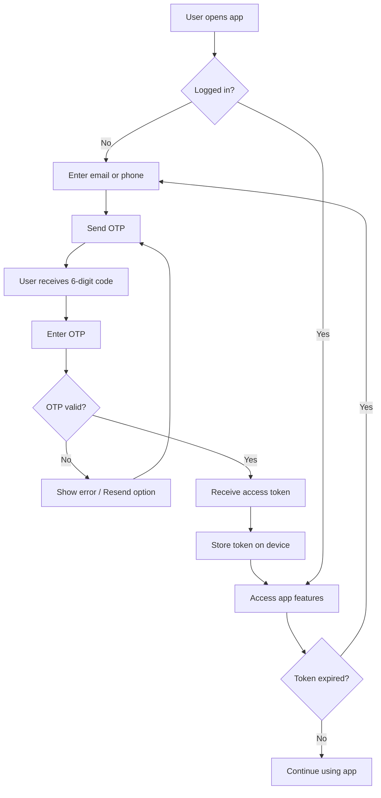
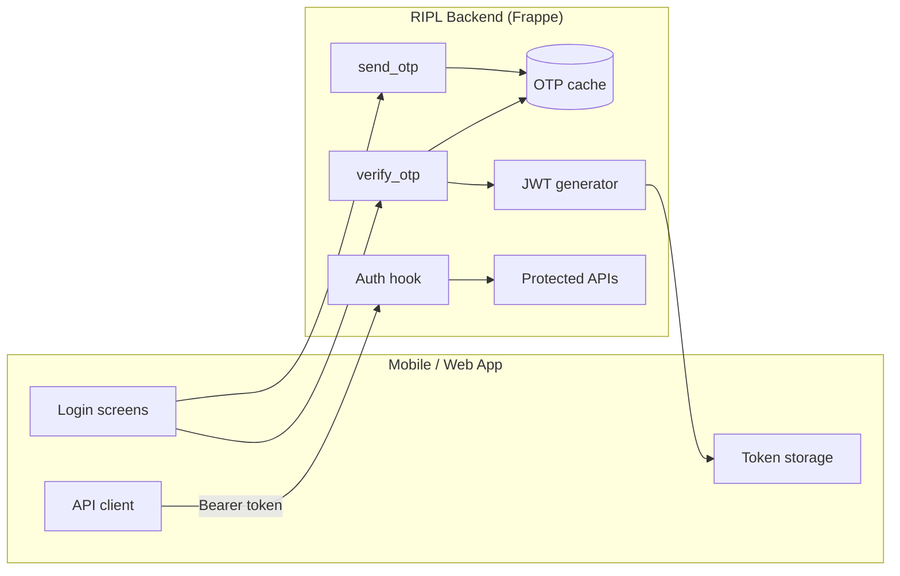
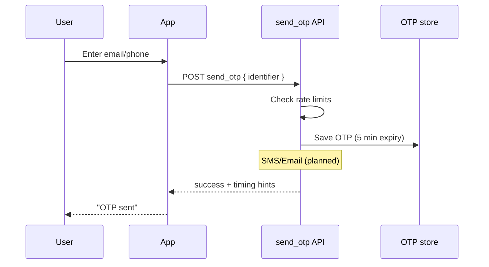
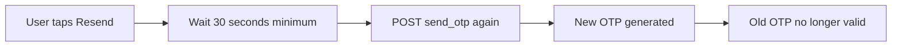
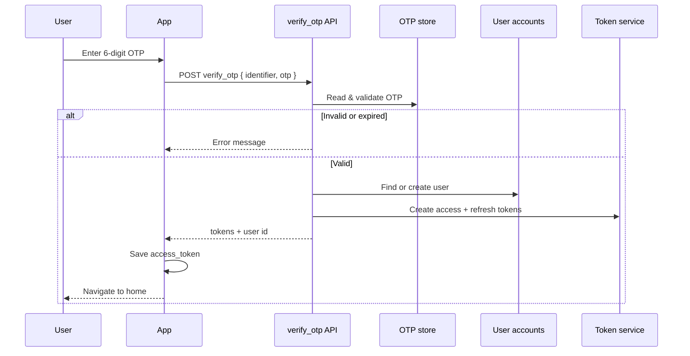
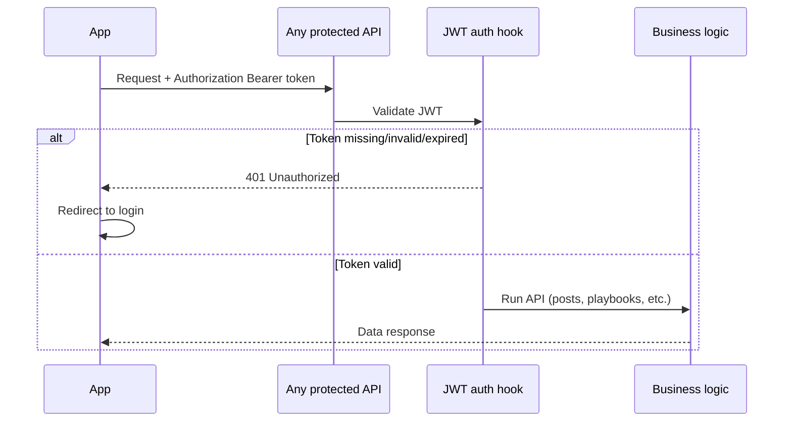
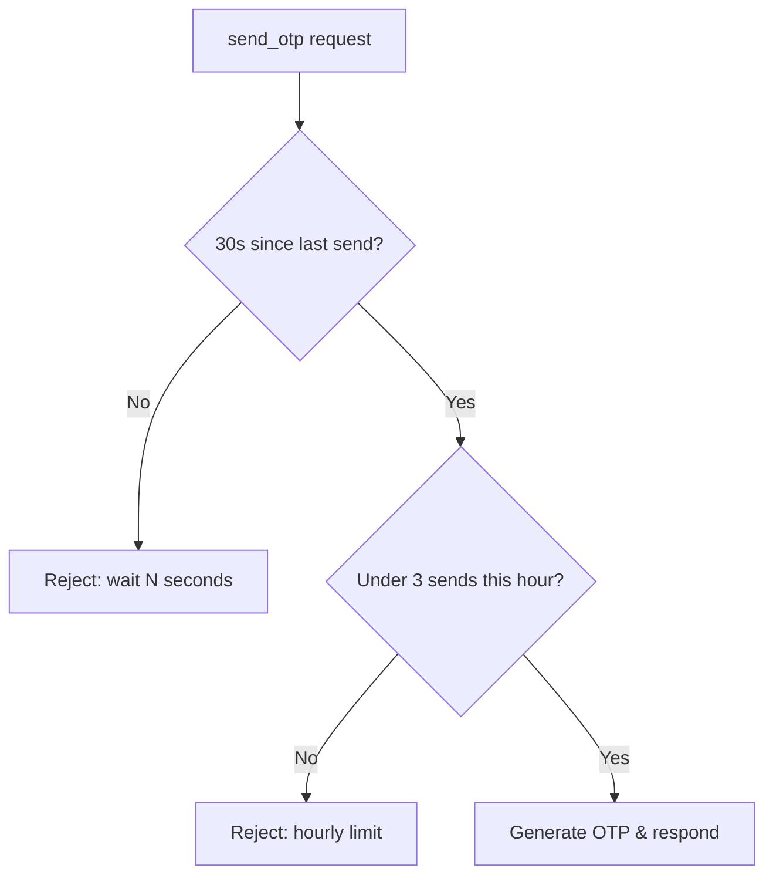

# RIPL — Login & Authentication Workflow

**Document purpose:** Knowledge transfer for stakeholders, product, and frontend teams.  
**Technical level:** Medium — accurate without deep engineering jargon.  
**Last updated:** May 2026

---

## 1. Executive summary

RIPL uses a **passwordless login** model:

1. User enters **email or phone**
2. System sends a **6-digit OTP** (one-time password)
3. User enters OTP → system verifies and returns a **secure access token**
4. The mobile/web app stores the token and sends it on every protected request

There is **no traditional password** and **no browser session cookie** for the app. Authentication is handled with **JWT Bearer tokens** (industry-standard signed tokens).

| Capability | Status |
|------------|--------|
| Send OTP | Live |
| Verify OTP & login | Live |
| Resend OTP (same API) | Live |
| Rate limiting (30s + 3/hour) | Live |
| JWT access & refresh tokens | Live (refresh API planned) |
| Protected APIs (posts, playbooks, etc.) | Live |
| SMS / Email delivery | Planned |
| Token refresh without re-login | Planned |

---

## 2. High-level user journey



---

## 3. System architecture (simplified)



**How it fits together**

| Layer | Role |
|-------|------|
| **Login APIs** | Generate and verify OTP; issue tokens |
| **OTP cache** | Temporary storage (5 minutes); previous OTP invalidated on resend |
| **JWT** | Signed token tied to a real user account |
| **Auth hook** | Validates token on every API request before business logic runs |
| **Protected APIs** | Posts, playbooks, profile, etc. — require valid token |

---

## 4. Detailed login flow

### 4.1 Step 1 — Request OTP



| Item | Detail |
|------|--------|
| **API** | `ripl.api.auth.send_otp` |
| **Input** | Email or phone (`identifier`) |
| **Optional flag** | `is_resend: true` when user taps Resend |
| **OTP validity** | 5 minutes |
| **Delivery today** | OTP is generated server-side; SMS/email integration is next phase |

### 4.2 Step 2 — Resend OTP (same API)

Resend uses the **same endpoint** as the first send — no separate “resend” API.



| Rule | Limit | Enforced by |
|------|-------|-------------|
| Minimum gap between sends | **30 seconds** | Backend + recommended on UI |
| Maximum sends per hour | **3 per email/phone** | Backend |
| Resend invalidates previous code | Yes | Backend |

**Analytics fields** (for product insights):

| Field | Meaning |
|-------|---------|
| `is_resend` | Whether this request was a resend |
| `resend_count` | How many resends in the current hour (0 = first send) |

### 4.3 Step 3 — Verify OTP & login



| Item | Detail |
|------|--------|
| **API** | `ripl.api.auth.verify_otp` |
| **On success** | Returns `access_token`, `refresh_token`, `user` |
| **New users** | Account created automatically on first successful login |
| **User type** | Website User (app end-user) |

---

## 5. After login — using the app

### 5.1 Token-based access



| Token type | Lifetime | Used for |
|------------|----------|----------|
| **Access token** | 1 day | All app API calls |
| **Refresh token** | 7 days | Future silent renewal (not yet exposed via API) |

**Important for the app**

- Store `access_token` securely on the device
- Send header on every protected call: `Authorization: Bearer <access_token>`
- On **401**, clear storage and show login again
- Do **not** rely on cookies or Frappe desk session

### 5.2 What requires login vs what does not

| Feature area | Login required? | Examples |
|--------------|-----------------|----------|
| Login / OTP | No | `send_otp`, `verify_otp` |
| Regulatory circulars (browse) | No | List, detail, search |
| Subscription plans (view) | No | `get_plans` |
| Posts feed & detail | **Yes** | `get_posts`, `get_post_detail` |
| Playbooks & learning | **Yes** | Catalog, content, quizzes, progress |
| User profile test | **Yes** | `get_profile` |

---

## 6. Security & abuse prevention

| Control | Description |
|---------|-------------|
| **OTP expiry** | Codes expire after 5 minutes |
| **Single-use OTP** | Successful login consumes the code |
| **Resend invalidation** | New OTP replaces the old one |
| **30-second cooldown** | Prevents rapid OTP spam |
| **3 requests / hour** | Per email or phone |
| **JWT signing** | Tokens cannot be forged without server secret |
| **User validation** | Token must map to an active user account |
| **Access vs refresh** | Only access token accepted for data APIs |
| **Logging** | Login, resend, and auth failures are logged for support |



---

## 7. API reference (client-facing)

**Base URL:** Your environment URL, e.g. `https://your-domain.com`  
**Format:** `POST/GET {base}/api/method/{api.path}`  
**Responses:** Data is inside a `message` field in the JSON body.

### 7.1 Login APIs (no token needed)

| API | Method | Purpose |
|-----|--------|---------|
| `ripl.api.auth.send_otp` | POST | Send or resend OTP |
| `ripl.api.auth.verify_otp` | POST | Verify OTP and login |

**send_otp — request**

```json
{
  "identifier": "user@example.com",
  "is_resend": false
}
```

**send_otp — success (example)**

```json
{
  "success": true,
  "message": "OTP sent",
  "is_resend": false,
  "resend_count": 0,
  "retry_after_seconds": 30,
  "cooldown_seconds": 30,
  "expires_in_seconds": 300,
  "max_hourly_attempts": 3,
  "hourly_attempts_used": 1,
  "hourly_attempts_remaining": 2
}
```

**verify_otp — success (example)**

```json
{
  "success": true,
  "access_token": "<jwt>",
  "refresh_token": "<jwt>",
  "user": "user@example.com"
}
```

### 7.2 Protected APIs (token required)

Send header: `Authorization: Bearer <access_token>`

| Module | APIs (examples) |
|--------|-----------------|
| **Posts** | List feed, post detail, create, delete |
| **Playbooks** | Catalog, detail, content, chapters, quizzes, progress |
| **Profile** | `get_profile` (connectivity check) |

Full technical list: see [frontend-auth-integration.md](./frontend-auth-integration.md).

---

## 8. Error handling (user-facing)

| Situation | Typical message | App behaviour |
|-----------|-----------------|---------------|
| Wrong OTP | Invalid OTP | Let user retry |
| Expired OTP | OTP expired | Offer resend |
| Resend too soon | Please wait N seconds | Disable resend button, show countdown |
| Too many OTP requests | Maximum OTP requests reached | Show try again later |
| Missing token | Authentication required | Go to login |
| Expired token | Token expired / 401 | Go to login |
| Invalid token | Invalid token / 401 | Go to login |

---

## 9. Development vs production

| Aspect | Development | Production |
|--------|-------------|------------|
| Test account | `test@ripl.dev` | Not available |
| Test OTP | `123456` | Real OTP via SMS/email (when live) |
| Dev flags in API | `dev_mode`, `dev_test_otp` may appear | Hidden |
| Rate limits | Still enforced | Enforced |
| OTP in server logs | Visible for testing | Not exposed to users |

**Note:** Hardcoded test credentials work only when the server is in developer mode. Production builds must not depend on them.

---

## 10. Roadmap (planned enhancements)

| Item | Benefit |
|------|---------|
| SMS / Email OTP delivery | Users receive codes on their device |
| Refresh token API | Stay logged in beyond 1 day without new OTP |
| Stronger subscription checks | Tie playbooks to paid plans |
| Production analytics dashboard | Track resend rates and login funnel |

---

## 11. Roles & responsibilities

| Team | Responsibility |
|------|----------------|
| **Backend** | OTP, tokens, rate limits, API security |
| **Frontend / Mobile** | Login UI, token storage, Bearer header, resend cooldown UI |
| **Product** | Copy, retry limits communication, funnel metrics via `is_resend` / `resend_count` |
| **Infrastructure** | HTTPS, `jwt_secret` configuration, SMS/email providers (future) |

---

## 12. Quick FAQ

**Q: Do users need a password?**  
A: No. Login is OTP-only.

**Q: Can users stay logged in forever?**  
A: Access token lasts 1 day. After that, they log in again with OTP until refresh API is added.

**Q: Is resend a different API?**  
A: No. Same `send_otp` with optional `is_resend: true`.

**Q: Why did my API return 401?**  
A: Missing, wrong, or expired Bearer token. Log in again.

**Q: Why did my API return 403 earlier?**  
A: Usually a configuration/whitelist issue (now fixed) or permission — contact support if it persists.

**Q: Are circulars public?**  
A: Yes — browsing circulars does not require login.

---

## 13. Related documents

| Document | Audience |
|----------|----------|
| [frontend-auth-integration.md](./frontend-auth-integration.md) | Frontend developers (detailed integration) |
| [README.md](./README.md) | Index of all stories |

---

*Prepared for RIPL client KT — authentication module v1.*
